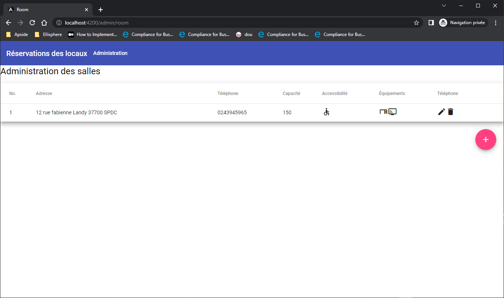
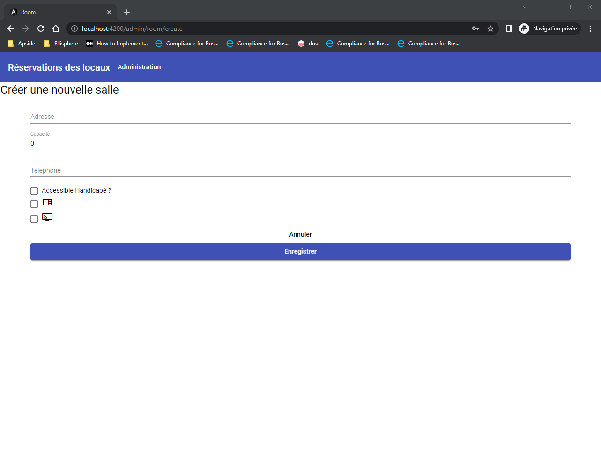
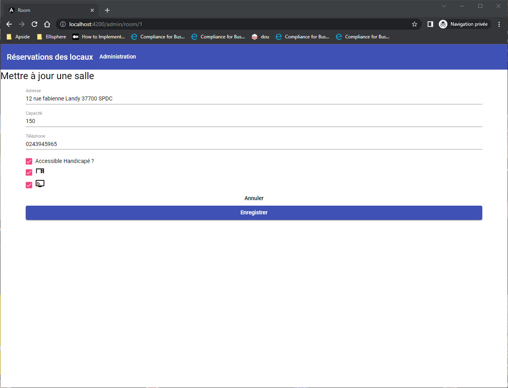

author: Yann-Thomas Le Moigne
summary: Angular TP - Mise en pratique de la formation de base
id: codelab-angular-tp-fil-rouge
categories: angular, débutant, TP
environments: Web
status: Published
feedback link: https://github.com/yatho/angular-tp

# Angular TP - Mise en pratique de la formation Angular initiale

## Introduction
Duration: 0:00:00

L'objectif de ce Codelabs est de pratiquer le framework Angular pour voir si vous avez acquis les bases de développement.

Vous pouvez partager avec un Tech Lead votre avancée sur le sujet via un repo GIT.

Il est demandé au cours de ce TP d'utiliser toute les bonnes pratiques vu lors de la formation initiale Angular.

## Chapitre 0 : Initialisation du projet
Duration: 0:30:00

- Création du projet à l'aide d'angular cli
- Migrer les tests unitaires pour la librairie jest
- Ajouter la librairie material
- Mise à jour du projet généré pour utiliser les standalones components (Optional)
- Procédé à l'affichage d'une navbar material et d'un titre
- Vérifier que les tests sont ok

## Chapitre 1 : Création d'un CRUD local
Duration: 1:30:00

- Création du CRUD "local" pour la gestion des salles pour une future interface d'administration:
- La suppression doit demander une validation de l'action, puis recharger la liste en cas de suppression
- Suite à l'action de mise à jour ou de création, on retourne sur la liste des salles.
- La gestion des salles est faite de façon à pouvoir brancher une API par la suite.

Object room ->
```json
{
    id -> int
    capacity -> int
    accessibility -> boolean
    equipments: [
        TABLE,
        VISIO
    ],
    address: string,
    telephone: string
}
```

Voici un exemple des écrans attendus :

La liste des salles :


Création d'une salle :


Mise à jour d'une salle :


## Chapitre 2 : Utiliser des APIs
Duration: 0:10:00

- Récupérer le backend
    - [Télécharger le backend](https://download-directory.github.io?url=https://github.com/yatho/angular-tp/tree/main/room-backend)
- Lancer le backend en mode non sécurisé :
    - Ouvrir un terminal
    - Ce positionner dans le dossier du backend
    - npm install
    - npm run build
    - npm run start:no-auth
    - Votre backend est disponible à l'adresse http://localhost:3000
- Mise à jour du CRUD pour se connecter à un backend non sécurisé.

## Chapitre 3 : Authentification
Duration: 0:30:00

- Lancement du backend sécurisé :
  - Ouvrir un terminal
  - Ce positionner dans le dossier du backend
  - npm install (si ce n'est pas déjà fait)
  - npm start
  - Votre backend est disponible à l'adresse http://localhost:3000
- Création d'une page de login.
- Création du service d'authentification.
- Sécurisation de l'appel au CRUD déjà fait dans le chapitre 2.
- Message d'erreur et redirection vers la page de login en cas d'erreur d'authentification.

## Chapitre 4 : Tester
Duration: 1:00:00

- Ajouter des tests jest si ce n'est pas déjà fait
- Ajouter des tests automatisers Cypress ou Playwright

<!-- ## Chapitre 5 : Bonnes pratiques de performance
Duration: 1:00:00

- Améliorer les performances (diminuer la taille des bundles générés + Optimiser le cycle de vie des objets angular).
- Augmenter la réutilisabilité du code.
- Déplacer les portions de code réutilisable dans une librairie séparée. -->

## Conclusion
Duration: 00:00:00

Vous avez mis en place :
- Une application Angular
- Un service CRUD
- Des composants materials
- Plusieurs formulaires
- Du routing
- Un service de connexion
- Un guard d'authentification
- Un Http Filter
- Des tests cypress/Playwright + jest 

Bravo, vous êtes prêt pour la formation avancée proposée par Apside TOP.